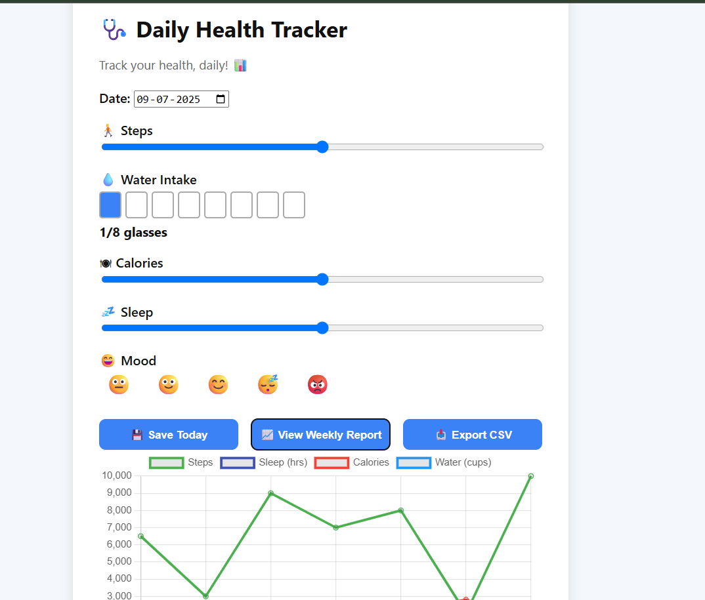
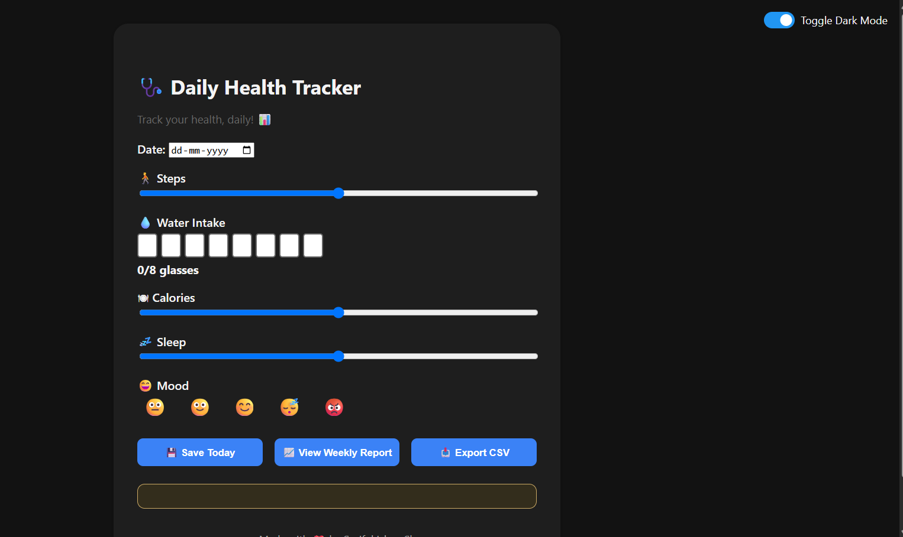

\# 🩺 Daily Health Tracker

A responsive and interactive web app that helps users track their daily health metrics, including steps, water intake, calories, sleep, and mood. It provides real-time feedback and weekly analytics with data visualization using Chart.js.

🔗 \[Live Demo](https://emcc2302.github.io/health-tracker/)

---

\## 📌 Features

\- 🌗 Light/Dark Mode Toggle

\- 📅 Daily input for:

&nbsp; - 🚶 Steps walked

&nbsp; - 💧 Water intake (glass-by-glass visual tracker)

&nbsp; - 🍽 Calories consumed

&nbsp; - 💤 Sleep hours

&nbsp; - 😄 Mood selection (emoji-based)

\- 💾 Save daily entries

\- 📈 Generate weekly report with interactive line chart

\- 📤 Export data to CSV

\- 💡 Smart health advice based on your inputs

---

\## 🛠️ Built With

\- \*\*HTML5\*\* – structure of the webpage

\- \*\*CSS3\*\* + \*\*Media Queries\*\* – modern and responsive styling

\- \*\*JavaScript\*\* – logic, dynamic updates, and chart rendering

\- \*\*Chart.js\*\* – for visualizing weekly reports

---

\## 📸 Screenshots

\## 📂 Folder Structure

health-tracker/

├── index.html

├── style.css

├── responsive.css

└── script.js

